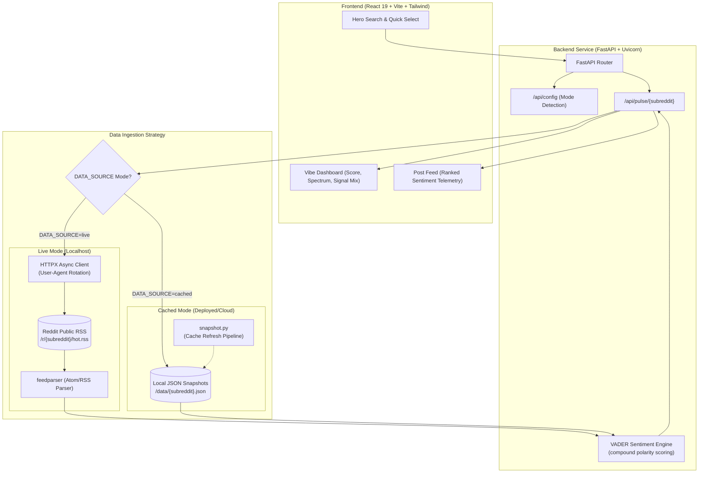

# The Subreddit Vibe Check 📡

<div align="center">

[](https://python.org)
[](https://fastapi.tiangolo.com)
[](https://react.dev)
[](https://vitejs.dev)
[](https://tailwindcss.com)
[](https://github.com/cjhutto/vaderSentiment)
[](https://pytest.org)

<p align="center">
  <strong>Real-Time Fan Culture Intelligence & Community Sentiment Radar</strong><br>
  <em>Instantly gauge the collective mood, hype, and frustration of any Reddit community.</em>
</p>

[**Explore Live Demo**](#live-demo) • [**Quickstart Guide**](#running-locally-live-mode) • [**Architecture**](#system-architecture) • [**API Reference**](#api-reference) • [**Deployment**](#production-deployment)

</div>

---

## 🌟 Overview

**The Subreddit Vibe Check** is a high-density, real-time analytics dashboard designed to monitor and quantify community emotion across Reddit. Built with the aesthetic precision of a financial telemetry terminal and a sports broadcast analytics suite, it processes dozens of concurrent discussions, applies lexical sentiment analysis, and translates chaotic fan discourse into actionable sentiment metrics in milliseconds.

Whether tracking trade deadline panic on `r/nba`, victory celebrations on `r/formula1`, or checking the pulse of any niche community on Reddit, Vibe Check delivers immediate emotional clarity.

---

## 📸 Visual Showcase

<div align="center">

### 🔍 Interactive Search & Quick Select


### 📊 Comprehensive Vibe Dashboard & Signal Analytics


### ⚡ Ranked Post Telemetry & Per-Thread Sentiment


</div>

---

## ✨ Key Features

- **⚡ Real-Time Sentiment Pulse**: Calculates an aggregate compound sentiment score between `-1.000` (Extreme Frustration / Toxicity) and `+1.000` (Peak Hype / Euphoria).
- **🎯 Dynamic Fanbase Status Indicator**: Classifies community atmosphere instantly into visual states:
  - `FANBASE HYPED` (Score $\ge +0.05$)
  - `NEUTRAL` ($-0.05 < \text{Score} < +0.05$)
  - `FANBASE FRUSTRATED` (Score $\le -0.05$)
- **📊 Granular Signal Distribution**: Visual breakdown of the exact ratio of positive, neutral, and negative posts shaping the conversation.
- **🔍 Outlier & Strongest Signal Detection**: Pinpoints the single most positive and most negative posts driving the current sentiment trajectory.
- **📜 Ranked Post Telemetry Stream**: View the top 50 hot posts with individualized sentiment scores, rankings, and color-coded status meters.
- **🎨 High-Density Broadcast Aesthetic**: Dark-themed, monospace-accented typography with responsive layout, zero clutter, and smooth micro-animations.
- **🛡️ Resilient Dual-Mode Architecture**: Supports both keyless **Live RSS streaming** (local development for any subreddit) and **Cached Snapshot mode** (for reliable, rate-limit-proof cloud deployments).

---

## 🏗️ System Architecture



---

## 🔄 Data Modes: Live vs. Cached

This project implements a dual-mode data architecture to balance real-time search freedom with cloud deployment reliability:

| Mode | Target Environment | Subreddit Coverage | Latency | Reddit API Credentials |
| :--- | :--- | :--- | :--- | :--- |
| **`live`** | **Local Development** | **Any valid subreddit** on Reddit | Real-time (~300-800ms) | None required (uses public Atom RSS) |
| **`cached`** | **Production / Cloud (Render/Vercel)** | 5 Pre-saved Sports Subreddits (`nfl`, `nba`, `baseball`, `formula1`, `soccer`) | Instant (<15ms) | None required (reads local JSON snapshots) |

### 💡 Why the Dual-Mode Strategy?
1. **Reddit API Policy Shift**: In November 2025, Reddit closed self-service OAuth app registration for new developers under their [Responsible Builder Policy](https://support.reddithelp.com/hc/en-us/articles/42728983564564-Responsible-Builder-Policy).
2. **Datacenter IP Blocking**: Reddit strictly blocks and rate-limits anonymous requests originating from cloud provider IPs (Render, AWS, GCP, Vercel).
3. **The Solution**:
   - When running **locally**, your residential IP allows direct, unauthenticated Atom RSS streaming (`https://www.reddit.com/r/{subreddit}/hot.rss`), enabling live searches for **any** subreddit.
   - In **production**, the app operates in `cached` mode using pre-built snapshots from the `data/` directory, ensuring 100% uptime with zero risk of HTTP 429 rate-limiting.

---

## 🚀 Quickstart & Local Installation (Live Mode)

Run the full live application locally to search and analyze **any subreddit** in real-time.

### Prerequisites
- **Python 3.10+**
- **Node.js 18+** & **npm**

---

### Step 1: Clone the Repository
```bash
git clone https://github.com/SHAIK-FIRDOS-01/The-Subreddit-Vibe-Check.git
cd The-Subreddit-Vibe-Check
```

---

### Step 2: Setup the Python Backend
Create a virtual environment and install backend dependencies:

```bash
# Create virtual environment (optional but recommended)
python -m venv venv

# Activate virtual environment
# Windows (PowerShell):
.\venv\Scripts\Activate.ps1
# macOS / Linux:
source venv/bin/activate

# Install Python requirements
pip install -r requirements.txt
```

---

### Step 3: Configure Environment Variables
Create your root `.env` file from the provided example:

```bash
# Windows:
copy .env.example .env

# macOS / Linux:
cp .env.example .env
```

Ensure `DATA_SOURCE=live` is set inside your root `.env`:
```env
# .env (Root Directory)
DATA_SOURCE=live
```

---

### Step 4: Setup the React Frontend
Navigate to the frontend directory and install dependencies:

```bash
cd frontend
npm install
```

*(Optional)* Create a `frontend/.env` file if running the backend on a custom port:
```env
# frontend/.env
VITE_API_URL=http://localhost:8000
```

---

### Step 5: Start Development Servers

#### Terminal 1 — Start the FastAPI Backend (from project root):
```bash
python -m uvicorn main:app --reload --port 8000
```
> Backend API will be live at `http://localhost:8000` (Swagger docs available at `http://localhost:8000/docs`).

#### Terminal 2 — Start the Vite Frontend (from `frontend/` directory):
```bash
cd frontend
npm run dev
```
> Frontend client will launch at `http://localhost:5173`.

Open your browser to **[http://localhost:5173](http://localhost:5173)** and start exploring!

---

## 📦 Snapshot & Cache Management (`snapshot.py`)

The repository includes a dedicated snapshot generation script (`snapshot.py`) used to generate and refresh the JSON data used in production cached mode.

### Refreshing Cached Data
To fetch the latest hot posts for all configured subreddits and update `data/*.json`:

```bash
python snapshot.py
```

### Adding New Subreddits to the Snapshot Pipeline
1. Open `snapshot.py` and add your subreddit name to the `SUBREDDITS` list:
   ```python
   SUBREDDITS = ["nfl", "nba", "baseball", "formula1", "soccer", "technology", "gaming"]
   ```
2. Open `reddit.py` and append the new subreddit to `CACHED_SUBREDDITS`:
   ```python
   CACHED_SUBREDDITS = ["nfl", "nba", "baseball", "formula1", "soccer", "technology", "gaming"]
   ```
3. Run `python snapshot.py` to generate the new `.json` file in `data/`.

### Snapshot Schema (`data/{subreddit}.json`)
```json
{
  "subreddit": "nba",
  "fetched_at": "2026-08-19T13:42:02Z",
  "titles": [
    "Wemby making Gobert look like an undersized shooting guard.",
    "Bulls head coach Doug Collins and MJ showed reporters everything was fine...",
    "..."
  ]
}
```

---

## 🌐 Production Deployment

### Backend Deployment (e.g., Render, Railway, Fly.io)
1. Set the root directory of your web service to the repository root.
2. **Build Command**: `pip install -r requirements.txt`
3. **Start Command**: `uvicorn main:app --host 0.0.0.0 --port $PORT`
4. **Environment Variables**:
   - `DATA_SOURCE=cached` (Ensures the backend safely serves snapshot files on datacenter IPs without getting blocked by Reddit).

### Frontend Deployment (e.g., Vercel, Netlify, Cloudflare Pages)
1. Set the root directory / framework preset to `frontend` (Vite).
2. **Build Command**: `npm run build`
3. **Output Directory**: `dist`
4. **Environment Variables**:
   - `VITE_API_URL=https://your-backend-service.onrender.com` (Points to your live backend).

---

## 🔌 API Reference

### 1. Health Check
`GET /health`

**Response:**
```json
{
  "status": "ok"
}
```

---

### 2. Runtime Configuration
`GET /api/config`

Informs the frontend of the active backend data mode.

**Response (`live` mode):**
```json
{
  "data_source": "live"
}
```

**Response (`cached` mode):**
```json
{
  "data_source": "cached",
  "available_subreddits": ["nfl", "nba", "baseball", "formula1", "soccer"]
}
```

---

### 3. Subreddit Sentiment Pulse
`GET /api/pulse/{subreddit}`

Fetches hot posts, runs VADER compound sentiment analysis, and returns the aggregated vibe telemetry.

**Parameters:**
- `subreddit` *(path, string, required)*: The target subreddit name (e.g. `nba`, `technology`).

**Sample Response (`200 OK`):**
```json
{
  "subreddit": "nba",
  "aggregate_vibe_score": 0.1425,
  "fetched_at": "2026-08-19T13:42:02Z",
  "posts": [
    {
      "title": "Wemby making Gobert look like an undersized shooting guard.",
      "sentiment_score": 0.3612
    },
    {
      "title": "Jokic plays his best defense of the night in a loss to the Wolves",
      "sentiment_score": 0.4404
    },
    {
      "title": "This call by the referee was absolutely awful and ruined the game.",
      "sentiment_score": -0.7184
    }
  ]
}
```

---

## 🧪 Testing

Both backend and frontend include test suites covering API contracts, error states, and UI components.

### Running Backend Unit Tests
```bash
# Run all pytest suites
pytest
```
*Tests verify feed parsing, error handling (404/503/network failures), VADER calculation, and API responses using `pytest-httpx`.*

### Running Frontend Tests
```bash
cd frontend
npx vitest run
```
*Tests verify search sanitization, dashboard metric calculations, error banners, and post feed rendering.*

---

## 📂 Project Structure

```text
The-Subreddit-Vibe-Check/
├── .env.example             # Backend environment variable template
├── requirements.txt         # Python backend dependencies
├── main.py                  # FastAPI server application & endpoints
├── reddit.py                # Core data fetcher (Live RSS & Cached dispatcher)
├── snapshot.py              # Offline snapshot generator utility
├── test_main.py             # FastAPI health & basic route tests
├── test_pulse.py            # API pulse endpoint integration tests
├── test_reddit.py           # RSS ingestion & error handling unit tests
├── data/                    # Pre-fetched snapshot JSON files (Production mode)
│   ├── baseball.json
│   ├── formula1.json
│   ├── nba.json
│   ├── nfl.json
│   └── soccer.json
├── frontend/                # React 19 + Vite frontend
│   ├── package.json         # Frontend dependencies & scripts
│   ├── vite.config.js       # Vite configuration
│   ├── tailwind.config.js   # Custom theme & typography tokens
│   └── src/
│       ├── main.jsx         # React application entry point
│       ├── App.jsx          # Root component & state management
│       ├── index.css        # Global CSS & design system tokens
│       └── components/
│           ├── HeroSearch.jsx     # Search input, validation & quick-select tags
│           ├── VibeDashboard.jsx  # Sentiment score gauge, signal mix & outliers
│           └── PostFeed.jsx       # Ranked post list with polarity badges
└── docs/                    # Architecture records & agent documentation
```

---

## 🛠️ Tech Stack

| Layer | Technologies |
| :--- | :--- |
| **Backend Framework** | [FastAPI](https://fastapi.tiangolo.com/), [Uvicorn](https://www.uvicorn.org/) |
| **Natural Language Processing** | [VADER Sentiment Analysis (`vaderSentiment`)](https://github.com/cjhutto/vaderSentiment) |
| **Data Ingestion & HTTP** | [HTTPX (Async HTTP)](https://www.python-httpx.org/), [Feedparser (Atom/RSS)](https://feedparser.readthedocs.io/) |
| **Frontend Framework** | [React 19](https://react.dev/), [Vite 8](https://vitejs.dev/) |
| **Styling & Design System** | [Tailwind CSS 3](https://tailwindcss.com/), Google Fonts (Space Grotesk, Syne, Inter) |
| **Icons & UI Accents** | [Lucide React](https://lucide.dev/), Material Symbols |
| **Testing** | [Pytest](https://pytest.org/), [pytest-httpx](https://colin-b.github.io/pytest_httpx/), [Vitest](https://vitest.dev/), Testing Library |

---

## 🤝 Contributing

Contributions are welcome! If you'd like to improve the UI, enhance the NLP scoring algorithm, or add support for additional telemetry metrics:

1. Fork the project
2. Create your feature branch (`git checkout -b feature/AmazingFeature`)
3. Commit your changes (`git commit -m 'Add some AmazingFeature'`)
4. Push to the branch (`git push origin feature/AmazingFeature`)
5. Open a Pull Request

---

## 📄 License

Distributed under the MIT License. See `LICENSE` for more information.
