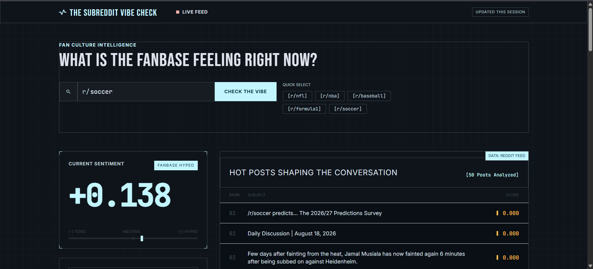
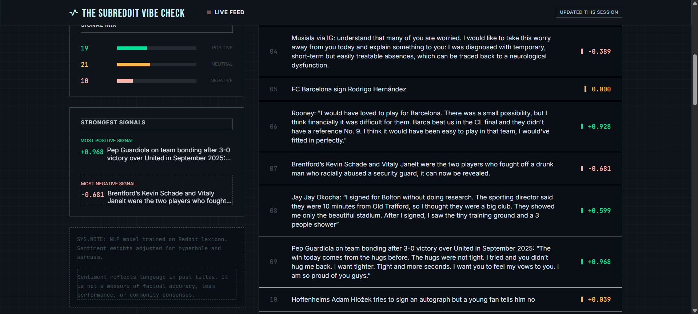
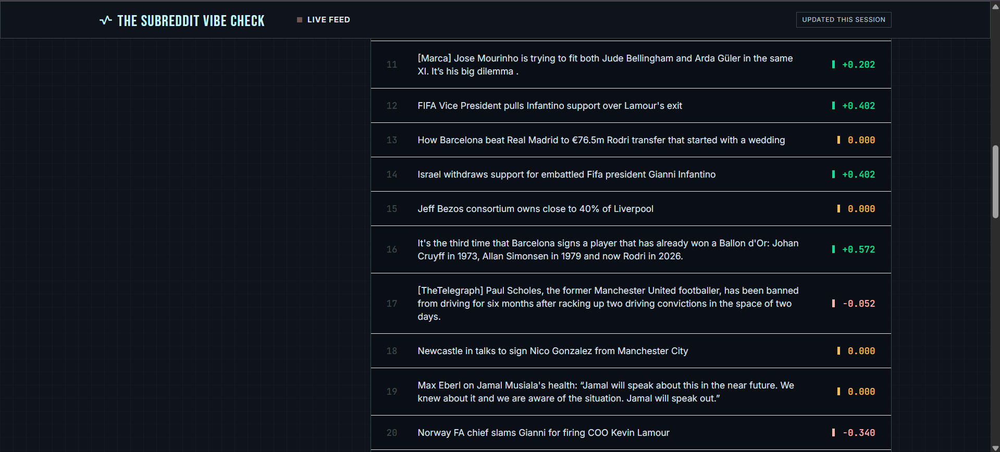
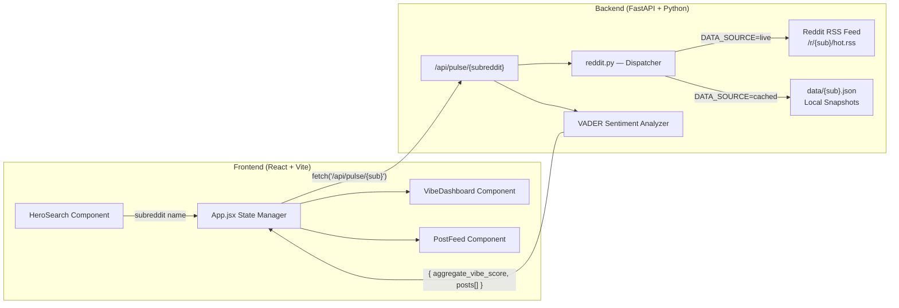

# The Subreddit Vibe Check

> **Real-time sentiment analysis dashboard for Reddit communities.**
> Search any subreddit and instantly see how the fanbase is feeling — powered by NLP, live RSS data (localhost), or cached snapshots (production).



---

## Table of Contents

- [Overview](#overview)
- [Screenshots](#screenshots)
- [Why RSS Instead of the Reddit API?](#why-rss-instead-of-the-reddit-api)
- [Architecture](#architecture)
- [Tech Stack](#tech-stack)
- [Prerequisites](#prerequisites)
- [Local Setup & Installation](#local-setup--installation)
- [Running the Application](#running-the-application)
- [Running Tests](#running-tests)
- [Project Structure](#project-structure)
- [How It Works](#how-it-works)
- [Limitations & Future Improvements](#limitations--future-improvements)

---

## Overview

**The Subreddit Vibe Check** is a full-stack web application that performs real-time sentiment analysis on any Reddit community. Enter a subreddit name (e.g. `r/nba`, `r/soccer`, `r/formula1`) and the app fetches the 50 hottest posts, runs each title through the **VADER** (Valence Aware Dictionary and sEntiment Reasoner) NLP engine, and returns:

- An **Aggregate Vibe Score** ranging from `−1.000` (toxic) to `+1.000` (hyped).
- A dynamic **sentiment badge** — `FANBASE HYPED`, `NEUTRAL`, or `FANBASE FRUSTRATED`.
- A **Signal Mix** breakdown showing the exact count of positive, neutral, and negative posts.
- The **Strongest Signals** — the single most positive and most negative post titles in the batch.
- A complete **ranked post feed** with individual sentiment scores and color-coded indicators.

---

## Screenshots

### Hero Search & Aggregate Vibe Gauge
The landing page features a terminal-styled search bar with quick-select chips for popular sports subreddits. Results load into the Aggregate Vibe gauge on the left and the ranked post feed on the right.


### Signal Breakdown & Post Feed
The dashboard shows a Signal Mix distribution bar (Positive / Neutral / Negative counts), the Strongest Signals module highlighting peak sentiment, and a methodology disclaimer. The post feed ranks all 50 titles with monospace indices and color-coded VADER scores.



### Ranked Post Feed (Continued)
Every post is rendered with its rank number, full wrapping title, a left-edge sentiment rail (mint for positive, amber for neutral, coral for negative), and the precise 3-decimal VADER compound score.



---

## Why RSS Instead of the Reddit API?

Reddit's official API requires a registered application with **OAuth 2.0 credentials**, and since November 2025 Reddit closed self-service API/OAuth access to new developers under the **Responsible Builder Policy**. For a project that needed to be built and demonstrated quickly, waiting on API approval was not viable.

**The solution:** Reddit publicly exposes an **RSS feed** for every subreddit at the URL pattern:

```
https://www.reddit.com/r/{subreddit}/hot.rss
```

This RSS feed returns the same "hot" posts visible on the subreddit's front page — no API key required, no OAuth flow, no approval wait. The backend fetches this XML feed using `httpx`, parses it with `feedparser`, and extracts up to 50 post titles for sentiment analysis.

**Trade-offs of this approach:**

| Factor | Reddit API | RSS Feed (our approach) |
|---|---|---|
| **Authentication** | OAuth 2.0 + app approval | None required |
| **Setup time** | Days–weeks for approval | Instant |
| **Rate limiting** | 60 requests/min (authenticated) | Best-effort; respectful headers |
| **Data richness** | Full post metadata, comments, votes | Titles and basic metadata only |
| **Reliability** | SLA-backed | Publicly available, no SLA |

### Live vs. Cached Data Modes

While RSS works perfectly on **localhost**, cloud hosting providers like Render have their datacenter IPs heavily rate-limited or blocked by Reddit. To solve this, the backend supports **two data modes**, controlled by the `DATA_SOURCE` environment variable:

| Mode | `DATA_SOURCE` | How it works | When to use |
|---|---|---|---|
| **Live** | `live` | Fetches from Reddit RSS in real-time | Localhost / local demos |
| **Cached** | `cached` (default) | Reads from pre-fetched JSON snapshots in `data/` | Production / Render deployment |

The cached snapshots contain **real Reddit data** fetched via the working RSS code and saved locally. Both code paths are fully present in `reddit.py` — the live RSS fetcher is never deleted or commented out.

The data-fetching layer (`reddit.py`) is designed as a **single swappable module** — the `DATA_SOURCE` env var controls which path is active, and the unified `fetch_hot_posts()` dispatcher routes to the correct implementation.

---

## Architecture



### Data Flow

1. **User Input** → The user types a subreddit name or clicks a quick-select chip.
2. **Frontend Request** → `App.jsx` sends a `GET` request to `/api/pulse/{subreddit}`.
3. **Data Fetch** → The FastAPI backend checks `DATA_SOURCE`:
   - `live` → Calls Reddit's public RSS feed and parses up to 50 post titles.
   - `cached` (default) → Reads from a pre-fetched JSON snapshot in `data/`.
4. **Sentiment Analysis** → Each title is scored using VADER's `compound` metric (range: −1 to +1).
5. **Aggregation** → The backend averages all 50 compound scores into a single `aggregate_vibe_score`.
6. **Response** → The JSON payload (subreddit name, aggregate score, scored posts, and optionally `fetched_at`) is returned to the frontend.
7. **Rendering** → React components render the gauge, signal breakdown, and ranked post feed in real time.

---

## Tech Stack

### Backend
| Technology | Purpose |
|---|---|
| **Python 3.10+** | Core runtime |
| **FastAPI** | High-performance async web framework |
| **Uvicorn** | ASGI server |
| **VADER Sentiment** | NLP sentiment analysis engine |
| **httpx** | Async HTTP client for fetching RSS feeds |
| **feedparser** | RSS/Atom XML parser |
| **pytest** | Testing framework |
| **pytest-httpx** | HTTP mocking for tests |
| **pytest-asyncio** | Async test support |

### Frontend
| Technology | Purpose |
|---|---|
| **React 19** | UI component library |
| **Vite 8** | Build tool and dev server |
| **Tailwind CSS 3** | Utility-first CSS framework |
| **PostCSS + Autoprefixer** | CSS processing pipeline |
| **Google Fonts** | Typography (Syne, Inter, JetBrains Mono) |
| **Material Symbols** | Iconography |
| **Vitest** | Frontend test runner |
| **React Testing Library** | Component test utilities |

---

## Prerequisites

Before you begin, make sure you have the following installed on your machine:

- **Python 3.10 or higher** — [Download Python](https://www.python.org/downloads/)
- **Node.js 18 or higher** (includes npm) — [Download Node.js](https://nodejs.org/)
- **pip** — Comes pre-installed with Python 3.10+
- **Git** (optional, for cloning) — [Download Git](https://git-scm.com/)

You can verify your installations by running:

```bash
python --version    # Should output Python 3.10+
node --version      # Should output v18+
npm --version       # Should output 9+
```

---

## Local Setup & Installation

### 1. Clone the Repository

```bash
git clone https://github.com/SHAIK-FIRDOS-01/The-Subreddit-Vibe-Check.git
cd The-Subreddit-Vibe-Check
```

### 2. Install Backend Dependencies

From the **project root** directory:

```bash
pip install -r requirements.txt
```

This installs FastAPI, Uvicorn, VADER Sentiment, httpx, feedparser, and the test libraries.

### 3. Configure the Data Source

Copy the example environment file and set your preferred data mode:

```bash
cp .env.example .env
```

Edit `.env` to set `DATA_SOURCE`:

- **`DATA_SOURCE=live`** — fetches from Reddit RSS in real-time (use for localhost demos)
- **`DATA_SOURCE=cached`** — reads from pre-fetched JSON snapshots in `data/` (default, use for production)

If `DATA_SOURCE` is not set, it defaults to `cached`.

### 4. Install Frontend Dependencies

Navigate to the `frontend/` directory and install the Node packages:

```bash
cd frontend
npm install
```

This installs React, Vite, Tailwind CSS, and all development tooling.

---

## Running the Application

You need **two terminal windows** — one for the backend server and one for the frontend dev server.

### Terminal 1 — Start the Backend

From the **project root**:

```bash
uvicorn main:app --port 8000
```

You should see:

```
INFO:     Uvicorn running on http://127.0.0.1:8000
INFO:     Application startup complete.
```

### Terminal 2 — Start the Frontend

From the `frontend/` directory:

```bash
npm run dev
```

You should see:

```
VITE v8.x.x  ready in XXXms

➜  Local:   http://localhost:5173/
```

### 4. Open the Application

Navigate to **http://localhost:5173** in your browser. Type a subreddit name (e.g. `nba`) or click one of the quick-select chips to see the sentiment analysis in action.

---

## Running Tests

### Backend Tests

From the **project root**:

```bash
pytest
```

Expected output:

```
test_main.py .                    [ 12%]
test_pulse.py ...                 [ 50%]
test_reddit.py ....               [100%]

8 passed
```

### Frontend Tests

From the `frontend/` directory:

```bash
npx vitest run
```

---

## Project Structure

```
the-subreddit-vibe-check/
│
├── main.py                  # FastAPI application — defines /health and /api/pulse endpoints
├── reddit.py                # Data fetcher — dual-mode: live RSS + cached JSON snapshots
├── requirements.txt         # Python dependencies
├── .env.example             # Example environment config (DATA_SOURCE)
│
├── data/                    # Pre-fetched JSON snapshots (used in cached mode)
│   ├── nfl.json
│   ├── nba.json
│   ├── baseball.json
│   ├── formula1.json
│   └── soccer.json
│
├── test_main.py             # Backend test — health endpoint
├── test_pulse.py            # Backend test — pulse endpoint with mocked RSS
├── test_reddit.py           # Backend test — RSS parser with mocked HTTP
│
├── frontend/
│   ├── index.html           # HTML entry point with font/icon imports
│   ├── package.json         # Node.js dependencies and scripts
│   ├── vite.config.js       # Vite build configuration with API proxy
│   ├── tailwind.config.js   # Custom design tokens (colors, fonts, spacing)
│   ├── postcss.config.js    # PostCSS pipeline (Tailwind + Autoprefixer)
│   │
│   ├── public/
│   │   ├── favicon.svg      # Browser tab icon
│   │   └── icons.svg        # SVG icon sprite
│   │
│   └── src/
│       ├── main.jsx         # React DOM entry point
│       ├── App.jsx          # Root component — state management, layout, API calls
│       ├── index.css        # Global styles, dark theme, grid background, utilities
│       │
│       ├── components/
│       │   ├── HeroSearch.jsx      # Search bar, input validation, quick-select chips
│       │   ├── VibeDashboard.jsx   # Aggregate gauge, signal mix, strongest signals
│       │   └── PostFeed.jsx        # Ranked post list with sentiment indicators
│       │
│       ├── App.test.jsx             # Frontend test — App component
│       ├── HeroSearch.test.jsx      # Frontend test — search logic
│       ├── PostFeed.test.jsx        # Frontend test — post rendering
│       └── VibeDashboard.test.jsx   # Frontend test — dashboard metrics
│
├── screenshot-hero.png      # UI screenshot — hero and gauge
├── screenshot-dashboard.png # UI screenshot — signal breakdown and feed
├── screenshot-feed.png      # UI screenshot — continued post list
│
├── .gitignore               # Git exclusions (caches, node_modules, env)
└── README.md                # This file
```

---

## How It Works

### Sentiment Analysis Engine

The backend uses **VADER** (Valence Aware Dictionary and sEntiment Reasoner), a lexicon and rule-based sentiment analysis tool specifically attuned to social media text. VADER is particularly effective for Reddit content because:

- It understands **slang, abbreviations, and emoticons** commonly used in online discussions.
- It handles **capitalization** (e.g., "AMAZING" scores higher than "amazing").
- It accounts for **degree modifiers** (e.g., "extremely good" vs. "good").
- It recognizes **negation** and **contrastive conjunctions** (e.g., "The food was great, but the service was terrible").

Each post title receives a **compound score** between −1.0 (most negative) and +1.0 (most positive). The aggregate vibe score is the arithmetic mean of all 50 compound scores.

### Vibe Classification

| Score Range | Badge | Color |
|---|---|---|
| ≥ +0.05 | FANBASE HYPED | Cyan |
| −0.05 to +0.05 | NEUTRAL | Amber |
| ≤ −0.05 | FANBASE FRUSTRATED | Coral |

---

## Limitations & Future Improvements

| Current Limitation | Planned Improvement |
|---|---|
| Uses RSS feed (titles only) | Migrate to official Reddit API for full post metadata, comment text, and vote counts |
| Cached data is a static snapshot | Automate periodic re-fetching (e.g. GitHub Actions cron) to keep snapshots fresh |
| Reddit blocks cloud IPs (Render) | Proxy through a residential IP service, or use a scheduled local snapshot pipeline |
| No persistent storage | Add a database (e.g. PostgreSQL) to track sentiment trends over time |
| Analysis limited to post titles | Extend VADER analysis to comment threads for deeper sentiment mining |
| Single-session data only | Implement historical charting to visualize sentiment trends across days/weeks |
| No user authentication | Add user accounts for saved subreddits and personalized dashboards |

---

<p align="center">
  <strong>Built with ❤️ using FastAPI, React, VADER, and Reddit RSS</strong><br/>
  <sub>The Subreddit Vibe Check — Fan Culture Intelligence</sub>
</p>
